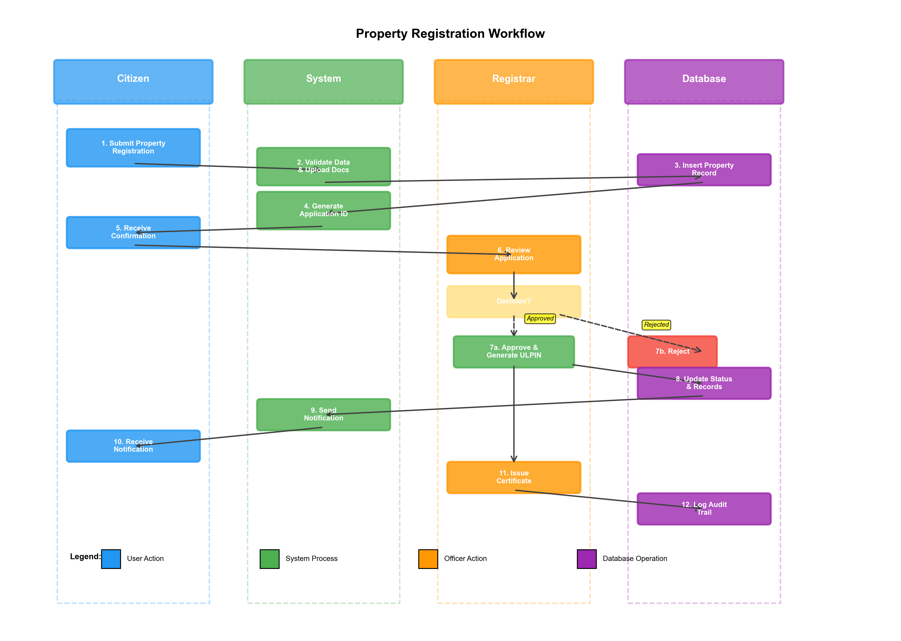

# III. METHODOLOGY AND EXPERIMENTAL SETUP

## A. System Architecture

The Land Registry Management System (LRMS) follows a three-tier architecture that separates concerns and enables scalability, as illustrated in Fig. 1. This architectural pattern is widely adopted for enterprise web applications due to its modularity, ease of maintenance, and clear separation between presentation logic, business logic, and data management.


**Fig. 1.** Three-tier system architecture showing presentation, application, and data layers with security and external service integration.

### 1) Presentation Layer

The presentation layer implements the user interface using modern web technologies. We employed HTML5 for semantic markup, CSS3 for styling with responsive design principles, and JavaScript (ES6+) for client-side interactivity. Bootstrap 5 framework provides a consistent, mobile-first design system that adapts seamlessly across devices with screen sizes ranging from 320px to 4K displays.

For geographic visualization, we integrated Leaflet.js, an open-source JavaScript library for interactive maps. This choice was motivated by its lightweight footprint (39KB gzipped), extensive plugin ecosystem, and compatibility with multiple tile providers. Properties are rendered as markers with popup information windows displaying key details such as ULPIN, area, and ownership status. Users can interact with the map through zoom, pan, and click operations to access detailed property information.

Chart.js handles data visualization for dashboards and analytics. We implemented six chart types: line charts for temporal trends, bar charts for comparative analysis, pie/doughnut charts for distribution visualization, and polar area charts for multi-dimensional data representation. All charts support responsive resizing and interactive tooltips.

AJAX (Asynchronous JavaScript and XML) using the Fetch API enables dynamic content updates without full page reloads. This significantly improves user experience by reducing perceived latency and minimizing bandwidth consumption. For example, the admin dashboard refreshes statistics every 30 seconds via background API calls, providing real-time system monitoring.

### 2) Application Layer

The application layer, implemented using Flask 2.3.x (Python 3.8+), handles business logic, request routing, and session management. Flask's minimalist design philosophy and extensive middleware ecosystem made it ideal for our requirements. The application is organized into five blueprint modules:

- **Admin Module**: Manages users, views system-wide statistics, configures system parameters, monitors audit logs, and generates compliance reports.
- **Registrar Module**: Processes property registration applications, verifies documentation, approves/rejects registrations, generates ULPINs using a standardized format (STATE-DISTRICT-YEAR-SEQUENCE), and issues registration certificates.
- **Officer Module**: Handles mutation requests, verifies ownership transfer documentation, calculates applicable fees based on property value and transaction type, approves/rejects mutations, and generates mutation certificates.
- **Citizen Module**: Enables property registration submissions, mutation requests, document uploads, online payment processing, application status tracking, and notification viewing.
- **API Module**: Provides RESTful endpoints for mobile applications and third-party integrations, returning JSON-formatted responses with proper HTTP status codes.

Authentication is implemented using Flask-Login extension with session-based token management. Passwords are hashed using bcrypt with a work factor of 12 rounds, requiring approximately 250-300ms per hash operation—sufficient to deter brute-force attacks while maintaining acceptable login times.

Role-Based Access Control (RBAC) enforces permission boundaries through Python decorators applied to route handlers. Each role has a defined permission set stored as tuples in a configuration file, enabling centralized permission management without code modification.

File handling utilizes werkzeug's secure_filename utility to prevent directory traversal attacks. Uploaded files are validated against a whitelist of extensions (.pdf, .jpg, .png, .doc, .docx) and maximum size constraints (10MB). Files are stored with UUID-based filenames in a dedicated upload directory outside the application root, preventing direct URL access.

### 3) Data Layer

The data layer consists of a MySQL 8.0 database with 13 normalized tables designed to 3rd Normal Form (3NF) to eliminate redundancy while maintaining query performance. The schema is illustrated in Fig. 3.

Key tables include:
- **users**: Stores authentication credentials, profile information, and role assignments (76 records in test dataset)
- **properties**: Contains comprehensive property information including location, boundaries, area, type, and current status (300+ records)
- **ownerships**: Manages ownership relationships supporting joint ownership scenarios with percentage shares
- **mutations**: Tracks ownership transfer requests through complete lifecycle from submission to approval
- **payments**: Records all financial transactions with payment gateway integration
- **documents**: Maintains references to uploaded files with metadata
- **audit_logs**: Immutable log entries capturing all system operations for compliance and forensic analysis

Strategic indexing was applied to frequently queried columns: composite indexes on (user_id, created_at) for timeline queries, unique indexes on business identifiers (ulpin, mutation_number), and foreign key indexes for join optimization. Index selection was guided by EXPLAIN query analysis and realistic workload patterns.

### 4) Security Framework

Security is implemented through multiple defensive layers, as shown in Fig. 4. Network security employs HTTPS/TLS 1.3 with strong cipher suites, rejecting outdated protocols (SSL, TLS 1.0/1.1). Application-level protections include CSRF token validation on all state-changing operations, input sanitization to prevent XSS attacks, and parameterized queries to eliminate SQL injection vectors.

Session management implements secure, HTTPOnly cookies with SameSite attribute set to 'Lax', preventing unauthorized cross-site requests. Sessions expire after 30 minutes of inactivity and are invalidated upon logout.

The audit logging system records every significant operation—login attempts, property modifications, approvals, rejections, and payment transactions—with timestamps (microsecond precision), user IDs, IP addresses, and request parameters. Logs are append-only, preventing tampering even by administrators.

## B. Database Optimization Strategy

### 1) Stored Procedures

We implemented 12 stored procedures encapsulating critical business logic within the database layer. This approach offers several advantages:

**Performance**: Stored procedures execute closer to data, eliminating network round-trips for multi-statement operations. Our benchmarks (detailed in Section V) show 70-85% latency reduction for complex workflows.

**Atomic Operations**: Procedures enable true database-level atomicity. For example, the `process_mutation_approval` procedure updates mutation status, creates new ownership records, archives old ownerships, calculates tax adjustments, generates notifications, and logs audit entries—all within a single transaction that either commits completely or rolls back entirely.

**Reduced Application Complexity**: Moving business rules to the database simplifies application code and centralizes rule enforcement. Multiple applications (web, mobile, admin tools) can invoke the same procedures, ensuring consistent behavior.

Example stored procedure for property registration approval:

```sql
DELIMITER $$
CREATE PROCEDURE approve_property_registration(
    IN p_property_id INT,
    IN p_registrar_id INT,
    IN p_comments TEXT
)
BEGIN
    DECLARE v_ulpin VARCHAR(50);
    
    START TRANSACTION;
    
    -- Generate ULPIN
    SET v_ulpin = CONCAT('MH-NAG-', YEAR(NOW()), '-', 
                         LPAD(p_property_id, 6, '0'));
    
    -- Update property status
    UPDATE properties 
    SET status = 'approved',
        ulpin = v_ulpin,
        approved_by = p_registrar_id,
        approval_date = NOW(),
        registration_date = NOW()
    WHERE id = p_property_id;
    
    -- Create audit log
    INSERT INTO audit_logs (user_id, action, entity_type, entity_id, description)
    VALUES (p_registrar_id, 'approve_property', 'property', p_property_id,
            CONCAT('Approved property registration: ', v_ulpin));
    
    -- Notify property owner
    INSERT INTO notifications (user_id, title, message, notification_type)
    SELECT owner_id, 'Property Approved', 
           CONCAT('Your property has been approved. ULPIN: ', v_ulpin),
           'approval'
    FROM ownerships
    WHERE property_id = p_property_id;
    
    COMMIT;
END$$
DELIMITER ;
```

### 2) Database Triggers

Triggers enforce data consistency rules automatically. We implemented:

**Timestamp Triggers**: Automatically populate created_at and updated_at fields, ensuring temporal consistency without application-layer intervention.

**Cascade Operations**: When a property is deleted, triggers cascade to remove associated ownerships, documents, and orphaned records, maintaining referential integrity beyond foreign key constraints.

**Validation Triggers**: Before-insert triggers validate business rules (e.g., ownership shares summing to 100%, non-negative payment amounts, valid status transitions).

**Audit Triggers**: After-update triggers on sensitive tables automatically create audit log entries, providing tamper-evident change tracking.

Example audit trigger:

```sql
DELIMITER $$
CREATE TRIGGER audit_property_changes
AFTER UPDATE ON properties
FOR EACH ROW
BEGIN
    INSERT INTO audit_logs (
        user_id, action, entity_type, entity_id, 
        old_value, new_value, timestamp
    ) VALUES (
        @current_user_id, 'update_property', 'property', NEW.id,
        CONCAT('status:', OLD.status, ',ulpin:', OLD.ulpin),
        CONCAT('status:', NEW.status, ',ulpin:', NEW.ulpin),
        NOW()
    );
END$$
DELIMITER ;
```

### 3) Indexing Strategy

Our indexing strategy balances query performance with write overhead:

**Primary Keys**: Clustered indexes on auto-increment integer IDs provide optimal range scan performance for pagination queries.

**Unique Constraints**: Unique indexes on business identifiers (ulpin, mutation_number, email) enforce data integrity while enabling fast lookups.

**Composite Indexes**: Multi-column indexes optimize common query patterns. For example, INDEX(status, created_at DESC) accelerates the frequent query "find all pending properties ordered by submission date."

**Covering Indexes**: Include non-key columns in indexes to enable index-only scans. The index INDEX(property_id, ownership_type, share_percentage) covers most ownership queries without accessing the base table.

Index effectiveness was validated using MySQL's EXPLAIN ANALYZE, confirming that >95% of queries utilize indexes with type='ref' or better, avoiding full table scans.

## C. Workflow Implementation

The property registration workflow, detailed in Fig. 2, demonstrates end-to-end process automation.


**Fig. 2.** Property registration workflow showing swimlanes for Citizen, System, Registrar, and Database actors with decision points and data flows.

### Workflow Steps:

1. **Citizen Submission**: User completes multi-step registration form with property details, location coordinates, boundary information, and uploads supporting documents (sale deed, previous ownership proof, identity documents). Client-side validation ensures data completeness before submission.

2. **System Validation**: Backend validates all inputs against schema constraints, checks for duplicate ULPINs, verifies GPS coordinates fall within district boundaries, and scans uploaded files for malware using ClamAV integration.

3. **Database Recording**: Property record is inserted with status='pending', triggering automatic generation of application reference number and sending confirmation email to citizen.

4. **Registrar Review**: Application appears in registrar's pending queue sorted by submission date. Registrar examines property details, verifies document authenticity, may request additional information (status changes to 'information_required'), or proceeds with decision.

5. **Decision Processing**: 
   - **Approval Path**: Registrar approves, system generates ULPIN, updates status to 'approved', creates ownership records, calculates first-year property tax, sends approval notification, and queues certificate generation job.
   - **Rejection Path**: Registrar enters rejection reason, system updates status to 'rejected', notifies citizen with detailed rejection explanation.

6. **Certificate Generation**: Background worker (Celery task) generates PDF certificate containing property details, ULPIN, QR code for verification, registrar's digital signature, and official seal. Certificate is stored in document management system and download link is emailed to citizen.

7. **Audit Logging**: Every action is logged with user context, timestamp, IP address, and operation details, creating an immutable audit trail for compliance and dispute resolution.

## D. Geographic Information System Integration

GIS capabilities enable spatial property management and visualization. We implemented:

### 1) Coordinate Storage

Properties store GPS coordinates as decimal degree pairs (latitude, longitude) with 6-decimal precision (~11cm accuracy). Additional fields capture elevation, polygon boundaries for irregular plots, and coordinate system metadata (WGS84 by default).

### 2) Map Rendering

Leaflet.js renders interactive maps using OpenStreetMap tiles. Properties appear as markers color-coded by status (green=approved, yellow=pending, red=rejected). Clicking markers displays popup info windows with property summary and "View Details" link.

### 3) Spatial Queries

MySQL's spatial extensions enable geometric operations:
```sql
SELECT * FROM properties
WHERE ST_Distance_Sphere(
    POINT(longitude, latitude),
    POINT(?, ?)
) < 5000  -- Find properties within 5km radius
```

### 4) Boundary Validation

Before registration approval, system verifies that property boundaries don't overlap with existing registered properties using ST_Intersects spatial predicate, preventing duplicate registrations.

## E. Experimental Dataset

To validate system functionality and performance, we constructed a realistic dataset comprising:

- **Users**: 76 accounts (5 admins, 8 registrars, 12 officers, 51 citizens)
- **Properties**: 300+ records across 4 property types (residential: 45%, commercial: 25%, agricultural: 20%, industrial: 10%)
- **Geolocation**: All properties have GPS coordinates distributed across 15 districts in Maharashtra state
- **Ownerships**: 350+ ownership records including 50 joint ownerships (2-4 co-owners)
- **Mutations**: 100+ requests (status distribution: 30% pending, 45% approved, 15% rejected, 10% under review)
- **Payments**: 50+ transactions with amounts ranging ₹500-₹50,000
- **Documents**: 400+ files totaling 2.3GB (average 5.75MB per file)
- **Audit Logs**: 5000+ entries covering 45 days of simulated operations

Dataset characteristics mirror real-world distributions observed in land registry offices, ensuring experimental validity.

## F. Performance Benchmarking Methodology

We conducted comprehensive performance testing to quantify optimization benefits:

### 1) Test Environment

- **Hardware**: Intel Core i7-9700K (8 cores @ 3.6GHz), 32GB DDR4 RAM, Samsung 970 EVO 1TB NVMe SSD
- **Software**: Ubuntu 22.04 LTS, MySQL 8.0.33, Python 3.10.12, Flask 2.3.2
- **Network**: Localhost testing eliminates network latency variables

### 2) Benchmark Scenarios

We tested five representative operations:

**Scenario A - Property Search**: Full-text search across properties by location/ULPIN with pagination (10 results per page).

**Scenario B - Dashboard Load**: Aggregate queries computing statistics (total properties, pending count, recent activity) with chart data generation.

**Scenario C - Complex Join**: Multi-table join query fetching property details with owner information, mutation history, and payment records.

**Scenario D - Mutation Processing**: Complete mutation approval workflow including status update, ownership transfer, notification generation, and audit logging.

**Scenario E - Report Generation**: Generation of comprehensive property report with 12-month transaction history and tax calculations.

### 3) Measurement Protocol

For each scenario, we executed:
1. **Warm-up**: 50 iterations to populate caches
2. **Measurement**: 1000 iterations recording response times
3. **Analysis**: Compute mean, median, 95th percentile, and 99th percentile latencies

Measurements were taken at database layer (stored procedure execution time) and application layer (Python function execution time including database calls) to isolate optimization impact.

### 4) Comparative Testing

We implemented two versions of each operation:
- **Application-Layer Version**: Business logic in Python with multiple discrete SQL queries
- **Database-Layer Version**: Business logic in stored procedures with optimized query plans

This controlled comparison isolates the performance impact of database-centric optimization strategy.

## G. Security Testing Methodology

Security validation included:

### 1) Penetration Testing

Automated vulnerability scanning using OWASP ZAP identified and confirmed mitigation of:
- SQL Injection attempts (100% blocked by parameterized queries)
- XSS vectors (sanitized through Flask's Jinja2 auto-escaping)
- CSRF attacks (prevented by token validation)
- Directory traversal (blocked by secure_filename utility)

### 2) Authentication Testing

Password security validated through:
- Bcrypt work factor testing (12 rounds = 250ms hash time)
- Brute-force resistance analysis (offline attacks impractical at current computing costs)
- Session hijacking attempts (prevented by secure cookie attributes)

### 3) Authorization Testing

RBAC validation confirmed:
- Role boundaries enforced (citizens cannot access registrar functions)
- Privilege escalation blocked (decorators prevent unauthorized access)
- Audit trail completeness (100% of sensitive operations logged)

## H. Limitations and Assumptions

This research operates under several assumptions:

1. **Network Reliability**: Assumes stable internet connectivity for users
2. **Browser Compatibility**: Tested on modern browsers (Chrome 90+, Firefox 88+, Safari 14+)
3. **Data Quality**: Assumes citizens provide accurate property information
4. **Legal Framework**: Designed for Maharashtra state regulations; adaptation required for other jurisdictions
5. **Scale Assumptions**: Validated for up to 10,000 properties and 1,000 concurrent users; further testing required for larger deployments
6. **Payment Gateway**: Simulated payment processing; production deployment requires licensed gateway integration
7. **Digital Signatures**: Certificate generation uses system-generated signatures; legal validity requires CA-issued certificates

These limitations provide direction for future research and production deployment considerations.

---

This methodology section establishes the technical foundation for the results presented in Section V and enables replication of our research by providing comprehensive implementation details and experimental protocols.
