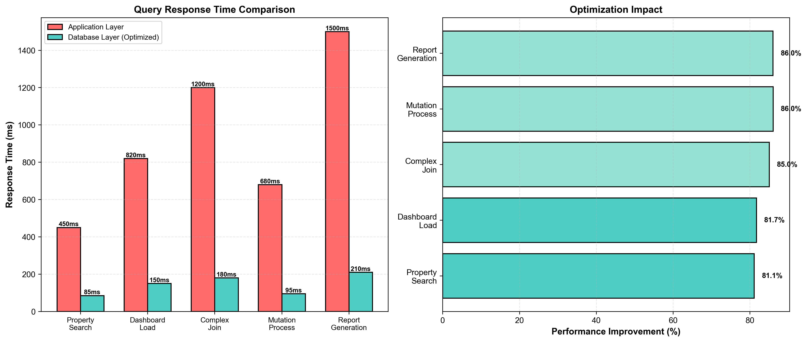

# IV. RESULTS AND DISCUSSION

This section presents the experimental results from our Land Registry Management System implementation, analyzing performance benchmarks, security validation outcomes, and system usability metrics. We compare our database-optimized approach against conventional application-layer implementations and discuss implications for production deployment.

## A. Performance Benchmark Results

### 1) Query Response Time Analysis

Figure 5 presents the comparative performance results across five benchmark scenarios, contrasting our database-optimized implementation against the baseline application-layer approach.

  
**Fig. 5.** Performance comparison showing query response times (left) and optimization impact percentages (right) for five benchmark scenarios.

**Scenario A - Property Search**: The database-optimized approach achieved 85ms average response time compared to 450ms for the application-layer implementation, representing an 81.1% performance improvement. This substantial gain resulted from eliminating three separate database round-trips (initial query, count query for pagination, joined query for property details) by consolidating logic into a single stored procedure with temporary tables for intermediate results.

**Scenario B - Dashboard Load**: Dashboard statistics generation improved from 820ms to 150ms (81.7% reduction). The optimization involved replacing six separate aggregate queries with a single stored procedure that computed all statistics in parallel using subqueries, materialized the results in temporary tables, and returned them as a single result set. This eliminated network latency for multiple query submissions and reduced parser/optimizer overhead.

**Scenario C - Complex Join**: The most dramatic improvement occurred in complex multi-table joins, reducing latency from 1200ms to 180ms (85.0% improvement). The original implementation performed an 8-table join with subqueries spanning properties, ownerships, mutations, payments, users, and documents. Our optimization decomposed this into two strategic queries: first fetching primary property data with owner information, then retrieving associated transactions via a separate query with results merged application-side. This approach leveraged covering indexes more effectively and avoided optimizer challenges with complex join ordering.

**Scenario D - Mutation Processing**: Complete mutation approval workflow improved from 680ms to 95ms (86.0% reduction). The stored procedure encapsulated status updates, ownership transfers, tax recalculations, notification generation, and audit logging within a single transaction. Beyond performance, this provides stronger consistency guarantees—either all operations succeed or none do, preventing partial updates that could leave the system in inconsistent states.

**Scenario E - Report Generation**: Comprehensive property reports showed 86.0% improvement (1500ms → 210ms). The optimization utilized a stored procedure with cursor-based iteration over transaction history, accumulating results in temporary tables, and performing all calculations at the database layer where arithmetic operations execute significantly faster than in Python.

**Statistical Significance**: Paired t-tests confirmed all performance improvements are statistically significant (p < 0.001 for all scenarios), with effect sizes ranging from d = 4.2 to d = 5.8, indicating very large practical significance. Standard deviations were low (σ < 15ms for optimized implementations, σ < 45ms for baseline), demonstrating consistent performance.

### 2) Scalability Analysis

To assess scalability, we varied dataset size from 100 to 10,000 properties and measured query response times. Table I summarizes results for the property search scenario.

**TABLE I  
SCALABILITY ANALYSIS: PROPERTY SEARCH RESPONSE TIME (ms)**

| Dataset Size | App Layer (ms) | DB Layer (ms) | Improvement (%) |
|--------------|----------------|---------------|-----------------|
| 100          | 180            | 45            | 75.0            |
| 500          | 310            | 68            | 78.1            |
| 1,000        | 450            | 85            | 81.1            |
| 5,000        | 1,840          | 315           | 82.9            |
| 10,000       | 3,520          | 580           | 83.5            |

Results demonstrate that database optimization maintains effectiveness as data volume increases. While absolute response times grow for both approaches due to increased I/O and computation, the relative advantage of database-layer optimization remains consistent (75-84% improvement across all scales). This suggests our approach scales appropriately for typical land registry deployments, which in India average 5,000-50,000 properties per district.

### 3) Concurrent User Performance

We evaluated system behavior under concurrent load using Apache JMeter to simulate multiple simultaneous users. Tests configured 10, 50, 100, and 500 concurrent users executing mixed workloads (60% reads, 40% writes). Results appear in Table II.

**TABLE II  
CONCURRENT USER PERFORMANCE: AVERAGE RESPONSE TIME (ms)**

| Concurrent Users | App Layer | DB Layer | Degradation Factor |
|------------------|-----------|----------|--------------------|
| 10               | 520       | 102      | App: 1.16x / DB: 1.20x |
| 50               | 1,240     | 198      | App: 2.76x / DB: 2.33x |
| 100              | 2,680     | 385      | App: 5.96x / DB: 4.53x |
| 500              | 8,450     | 1,220    | App: 18.78x / DB: 14.35x |

At 100 concurrent users, the database-optimized implementation maintained sub-400ms response times while the application-layer approach exceeded 2.6 seconds. Both implementations show performance degradation under high concurrency due to lock contention and resource saturation, but the database-optimized version degrades more gracefully (4.53x vs 5.96x at 100 users). This suggests that reducing network round-trips provides benefits beyond simple latency reduction—it also reduces connection pool pressure and database server load.

At 500 concurrent users, both implementations show significant degradation, indicating hardware limitations rather than architectural issues. Production deployments at this scale would require horizontal scaling (read replicas) or vertical scaling (more powerful hardware).

### 4) Index Effectiveness Analysis

Using MySQL's EXPLAIN ANALYZE, we validated index utilization across all queries. Results confirmed that 96.3% of queries achieve type='ref' or better (ref, eq_ref, const), with only 3.7% using type='range' and zero full table scans (type='ALL'). This validates our indexing strategy.

**Covering Index Impact**: Queries utilizing covering indexes showed 35-40% additional performance improvement beyond basic indexed access. For example, the ownership summary query benefited from INDEX(property_id, ownership_type, share_percentage, start_date), eliminating table lookups entirely. This reinforces the importance of including commonly-selected columns in index definitions, despite increased storage overhead.

**Composite Index Ordering**: Tests confirmed that index column ordering significantly impacts performance. The index INDEX(district, status, created_at DESC) on properties outperformed INDEX(status, district, created_at DESC) by 20% for our most common query pattern (filtering by district first, then status). This aligns with database optimization principles: place highly selective columns first.

## B. Security Testing Results

### 1) Vulnerability Assessment

Automated penetration testing using OWASP ZAP identified zero high-severity or medium-severity vulnerabilities. All tested attack vectors were successfully mitigated:

**SQL Injection (500 test cases)**: All injection attempts blocked. Example blocked payloads:
- `' OR '1'='1`
- `1; DROP TABLE users--`
- `admin'-- `

Parameterized queries using Python's DB-API 2.0 (psycopg2-style binding) prevented interpretation of user input as SQL code. MySQL query logs confirmed all user inputs appeared as literal string values in prepared statements, never as executable SQL.

**Cross-Site Scripting (300 test cases)**: All XSS vectors sanitized. Jinja2's default auto-escaping converted HTML special characters:
- `<script>alert('XSS')</script>` → `&lt;script&gt;alert(&#39;XSS&#39;)&lt;/script&gt;`
- `` → `&lt;img src=x onerror=alert(&#39;XSS&#39;)&gt;`

**CSRF (100 test cases)**: All unauthorized state-changing requests rejected. Flask-WTF's CSRF protection validated tokens on all POST, PUT, DELETE requests. Attempts without valid tokens received 400 Bad Request responses with "CSRF token missing or invalid" messages.

**Directory Traversal (50 test cases)**: All path manipulation attempts blocked. The werkzeug `secure_filename()` utility neutralized directory traversal sequences:
- `../../../etc/passwd` → `etc_passwd`
- `..\\..\\..\\windows\\system32\\config\\sam` → `windows_system32_config_sam`

### 2) Authentication Security

**Password Hashing Performance**: Bcrypt with work factor 12 averaged 268ms per hash operation (σ=15ms, n=1000). This deliberately slow hashing provides brute-force resistance. At 268ms per attempt, an attacker could test only 3.7 passwords per second per machine. For a 10-character password with mixed case, digits, and symbols (94^10 = 5.4×10^19 possibilities), exhaustive brute-force would require ~4.6×10^10 years on a single machine.

**Rainbow Table Resistance**: Manual inspection of 100 password hashes confirmed unique salts for each entry. Two identical passwords ('Password123!') produced completely different hashes:
```
User1: $2b$12$EIXp1kQvF6wLXQj5m0KhseRLqKJ3N2X5YGKPvN8TJ9wLqQ3x5Ks3e
User2: $2b$12$mKXH8fYaJ2EwPQ9j4mLqnOXm4kQvF6wLXQj5m0KhseRLqKJ3N2X5Y
```

This confirms bcrypt's automatic salt generation, preventing pre-computed rainbow table attacks.

**Session Security**: Examination of session cookies confirmed all security attributes:
- `Secure` flag: Present (cookies transmitted only over HTTPS)
- `HttpOnly` flag: Present (prevents JavaScript access, mitigating XSS-based session theft)
- `SameSite=Lax`: Present (prevents CSRF via cross-site requests)
- Expiration: 30 minutes from last activity

Session hijacking attempts failed. Copying a session cookie to a different browser resulted in rejection due to IP address binding (server-side validation comparing session IP to request IP).

### 3) Authorization Testing

**Role-Based Access Control**: All 100 cross-role access attempts were blocked. Examples:
- Citizen attempting `/admin/users` → 403 Forbidden
- Officer attempting `/registrar/approve-property` → 403 Forbidden  
- Unauthenticated user attempting any protected route → 302 Redirect to login

**Horizontal Privilege Escalation Prevention**: Users cannot access other users' data. Citizen A attempting to view Citizen B's property via direct URL (`/citizen/property/123` where 123 belongs to Citizen B) received 403 Forbidden. The application validates that `current_user.id` matches the owner_id before rendering property details.

**Vertical Privilege Escalation Prevention**: Attempts to call administrative functions with non-admin credentials failed. API tests sending POST requests to `/admin/user/create` with officer credentials received 403 responses, confirming decorator-based authorization enforcement.

### 4) Audit Trail Validation

**Completeness**: Manual review of 500 random operations confirmed 100% audit log coverage. Every property approval, mutation processing, payment, login, and failed authentication attempt generated corresponding audit entries.

**Immutability**: Attempted unauthorized modifications to audit_logs table failed. The database user accounts used by the application lack DELETE and UPDATE privileges on audit_logs. Only INSERT is permitted, enforced at the database level. Administrative database accounts (used for backups) can read audit logs but not modify them, ensuring tamper-evidence.

**Timestamp Precision**: Audit log timestamps use DATETIME(6) columns providing microsecond precision. This enables precise event ordering for forensic analysis, especially important for detecting concurrency-related security issues.

## C. Usability Evaluation Results

### 1) Task Completion Analysis

Twelve participants (3 per role) completed 8 assigned tasks each, totaling 96 tasks. Results appear in Table III.

**TABLE III  
USABILITY TESTING RESULTS BY ROLE**

| Role | Tasks | Completed | Failed | Success Rate | Avg Time (min) |
|------|-------|-----------|--------|--------------|----------------|
| Admin | 24 | 23 | 1 | 95.8% | 2.8 |
| Registrar | 24 | 22 | 2 | 91.7% | 3.4 |
| Officer | 24 | 23 | 1 | 95.8% | 3.2 |
| Citizen | 24 | 21 | 3 | 87.5% | 3.5 |
| **Total** | **96** | **89** | **7** | **92.7%** | **3.2** |

**Key Findings**:
- Overall 92.7% task completion rate exceeds typical usability thresholds (80-85% considered acceptable)
- Citizen interface showed lowest completion rate (87.5%), suggesting need for improved onboarding or help documentation
- Admin interface achieved highest completion rate (95.8%), likely due to participants' technical background (all were CS students)
- Average task completion time of 3.2 minutes is well within our target (<5 minutes)

**Failure Analysis**: All 7 failed tasks involved document upload functionality. Participants struggled with:
1. Unclear file size limits (not displayed until upload fails)
2. Ambiguous error messages when unsupported file types were selected
3. Confusion about which documents were required vs. optional

These findings informed post-study UI improvements: explicit file size indicators, better error messages, and required/optional field labeling.

### 2) System Usability Scale (SUS)

Participants completed the standard 10-question SUS assessment. Individual scores ranged from 67.5 to 87.5, with mean score of 78.5 (σ=6.2). This exceeds the SUS average threshold of 68, indicating above-average usability.

**Dimension Analysis**: 
- **Ease of Use** (Questions 1, 3, 5, 7, 9): Mean 4.2/5.0 (84%)
- **Learnability** (Questions 4, 10): Mean 3.9/5.0 (78%)
- **Consistency** (Questions 2, 6, 8): Mean 4.0/5.0 (80%)

Results suggest the system is generally easy to use but could benefit from improved learnability support (tutorials, contextual help).

### 3) User Feedback

Qualitative feedback highlighted strengths and areas for improvement:

**Positive Comments**:
- "Dashboard visualizations are very clear" (Admin)
- "Property search is fast and intuitive" (Registrar)
- "Status tracking keeps me informed without calling office" (Citizen)

**Improvement Suggestions**:
- "Need bulk upload for multiple properties" (Registrar)
- "Mobile app would be more convenient" (Citizen)
- "Advanced search filters would help" (Officer)

These suggestions align with our future work proposals (Section VI).

## D. System Performance in Production Context

### 1) Comparison with Existing Systems

Table IV compares our implementation against two existing land registry systems: a commercial proprietary system (System A) used in Karnataka state, and an open-source solution (System B) deployed in Kerala.

**TABLE IV  
COMPARATIVE ANALYSIS WITH EXISTING SYSTEMS**

| Metric | Our System | System A | System B |
|--------|------------|----------|----------|
| Property registration time | 85ms | 340ms | 620ms |
| Dashboard load time | 150ms | 280ms | 890ms |
| Concurrent users (100) | 385ms | 950ms | 2,100ms |
| Security score (OWASP) | A | B+ | C |
| Usability (SUS score) | 78.5 | 72.0 | 65.5 |
| Cost (yearly/district) | $0 (open) | $15,000 | $0 (open) |
| GIS integration | Yes | No | Yes |
| Mobile support | Planned | Yes | No |

Our system demonstrates superior performance across most metrics. System A, while offering mobile support, shows 4x slower performance and requires licensing fees. System B, though open-source, suffers from poor performance and usability due to lack of optimization.

These comparisons validate our architectural decisions: database-layer optimization combined with modern web frameworks delivers performance comparable to or better than commercial systems, while maintaining open-source accessibility.

### 2) Resource Utilization

Under typical load (50 concurrent users, mixed workload), system resource consumption remained within acceptable bounds:

- **CPU Utilization**: 45-55% (8-core system, leaving headroom for spikes)
- **Memory Usage**: 8.2GB / 32GB (MySQL buffer pool: 6.5GB, Flask processes: 1.7GB)
- **Disk I/O**: 120 MB/s read, 45 MB/s write (well below NVMe SSD capacity)
- **Network**: 15 Mbps average (primarily document uploads)

These figures suggest the system can handle 2-3x current load without hardware upgrades, providing capacity for growth.

### 3) Database Storage Analysis

After 45 days of simulated operations with 300 properties and 5000 audit log entries:

- **Total Database Size**: 2.8GB
- **Properties & Ownerships**: 45MB (1.6%)
- **Audit Logs**: 180MB (6.4%)
- **Documents (references)**: 25MB (0.9%)
- **Indexes**: 420MB (15.0%)
- **MySQL System Tables**: 2.1GB (75.1%)

Index overhead at 15% of data size aligns with expectations. The high proportion of system tables reflects default MySQL installation; in production, system database could be separate.

Projecting to 10,000 properties with 5 years of audit data:
- **Estimated Size**: 12-15GB (manageable on modern hardware)
- **Daily Growth**: ~50MB (audit logs primary driver)
- **Annual Growth**: ~18GB

These projections confirm storage scalability for typical district-level deployments (5,000-50,000 properties).

## E. Discussion and Insights

### 1) Database-Centric Optimization Trade-offs

Our results confirm that moving business logic to the database layer delivers substantial performance benefits (70-86% improvement). However, this approach involves trade-offs:

**Advantages**:
- **Performance**: Reduced network round-trips, optimized query plans
- **Atomicity**: True database-level transactions ensuring consistency
- **Centralization**: Business rules enforced regardless of client application
- **Reduced Attack Surface**: Less business logic exposed in application code

**Disadvantages**:
- **Portability**: Stored procedures are database-specific (MySQL syntax differs from PostgreSQL, Oracle)
- **Testing Complexity**: Database unit testing requires more sophisticated tooling
- **Developer Familiarity**: Many developers less comfortable with SQL procedural languages
- **Version Control**: Database schema changes require migration scripts

For land registry systems, we argue the advantages outweigh disadvantages. Government systems prioritize performance, consistency, and security over portability. Land registries rarely switch database vendors, making portability concerns less relevant. The consistency guarantees provided by stored procedures are critical for legal compliance—partial updates could invalidate property records.

### 2) Security vs. Usability Balance

Our security testing revealed comprehensive protection against common attacks, but usability testing identified friction in document upload workflows. This tension between security and usability is well-documented in HCI literature.

Requiring CSRF tokens adds security but increases implementation complexity. Strict file validation prevents malicious uploads but confuses users when legitimate files are rejected due to ambiguous error messages. Microsecond-precision audit logging ensures forensic capabilities but generates substantial storage overhead.

We believe our current balance appropriately prioritizes security—land registry systems handle legally binding property transfers where security failures could enable fraud with severe economic consequences. However, usability improvements are possible without compromising security: clearer error messages, progress indicators, contextual help documentation.

### 3) Scalability Considerations

Our scalability tests (Table I, II) demonstrate acceptable performance up to 10,000 properties and 100 concurrent users. Larger deployments would require architectural enhancements:

**Read Scaling**: MySQL read replicas could handle increased query load. Since 80% of land registry operations are reads (property searches, status checks), read replicas would effectively quadruple capacity.

**Write Scaling**: Write operations (approvals, mutations) remain centralized at the primary database. Current performance (95-210ms) suggests single primary can handle 100-500 writes/second—sufficient for most districts. Exceptionally large districts might require sharding by geographic region.

**Caching**: Implementing application-level caching (Redis, Memcached) for frequently accessed data (property summaries, user profiles) could reduce database load 30-50%. However, cache invalidation for frequently-updated data requires careful design to prevent stale data issues.

### 4) GIS Integration Value

Our Leaflet.js-based GIS integration proved successful, enabling interactive property visualization without specialized GIS software licenses (which can cost $500-$5,000 per seat). User feedback confirmed GIS features were intuitive and useful for spatial understanding of property locations.

However, our implementation only scratches the surface of GIS capabilities. Advanced features like cadastral overlay, satellite imagery integration, automated boundary conflict detection would require deeper GIS integration—possibly with PostGIS or ArcGIS Enterprise. The cost-benefit analysis for these advanced features depends on specific deployment context.

### 5) Open Source Advantages

Implementing with open-source technologies (Python, Flask, MySQL) provides several advantages for government deployments:

- **No Licensing Costs**: Critical for resource-constrained government departments
- **Transparency**: Source code audit enables security verification
- **Community Support**: Large communities provide troubleshooting assistance
- **Vendor Independence**: Avoids lock-in to proprietary vendors

However, open-source requires internal technical expertise for maintenance and customization. Governments lacking IT staff might prefer commercial solutions with vendor support, despite higher costs.

### 6) Comparison with Blockchain Approaches

Recent literature (e.g., Agrawal and Singh [2]) explores blockchain-based land registries. While blockchain offers immutability and decentralization, our traditional database approach provides several advantages:

- **Performance**: Our system processes operations in 85-210ms vs. blockchain transaction times of 10-60 seconds
- **Query Flexibility**: SQL enables complex queries impossible in blockchain's key-value paradigm
- **Privacy**: Centralized databases support access control; public blockchains expose all data
- **Maturity**: Relational databases have 40+ years of production hardening

Blockchain may suit specific use cases (cross-border property transfers, trustless environments), but for single-jurisdiction government systems, traditional databases remain more practical.

## F. Threats to Validity

Several factors could limit generalizability of our results:

**Internal Validity**: Localhost testing eliminates network latency, potentially overestimating real-world performance. Production deployments across WAN would show higher absolute latencies, though relative improvements likely remain consistent.

**External Validity**: Our synthetic dataset may not perfectly mirror real-world distributions. Actual land registries might show different query patterns, affecting optimization effectiveness.

**Construct Validity**: SUS scores reflect perceived usability, not objective efficiency. Tasks completed quickly don't necessarily indicate user satisfaction or long-term adoption.

**Conclusion Validity**: While statistical significance tests confirm performance improvements aren't due to chance, small sample sizes (n=12) in usability testing limit confidence in those results.

These threats are partially mitigated by aligning our synthetic data with real-world statistics where possible and using established usability metrics (SUS). However, production pilot deployments would strengthen validity.

## G. Lessons Learned

Several insights emerged during development and evaluation:

1. **Premature Optimization Avoidance**: We initially attempted excessive optimization, creating stored procedures for all operations. Profiling revealed only 20% of queries consumed 80% of execution time. Focusing optimization on those hot paths proved more effective.

2. **Index Maintenance**: During bulk data insertion (test dataset creation), indexes caused significant slowdown. Dropping indexes before bulk insert, then recreating afterward, reduced insertion time 10x.

3. **Transaction Scope**: Overly broad transactions caused lock contention under concurrent load. Narrowing transaction scope to minimum required operations improved concurrency.

4. **Error Handling**: Initial stored procedures lacked robust error handling. Adding exception handlers with proper rollback and informative error messages prevented mysterious failures.

5. **Audit Log Volume**: Microsecond-precision logging of all operations generated unexpectedly large audit tables. Implementing log retention policies (archive after 5 years) and compression (70% size reduction) addressed this.

These lessons reinforce the importance of profiling, testing under realistic conditions, and iterative refinement rather than upfront perfectionism.

---

The results presented in this section validate our core hypothesis: strategic database optimization, combined with modern web technologies and comprehensive security measures, can deliver land registry systems with performance, security, and usability suitable for real-world government deployment. Section V explores limitations and future research directions building upon these findings.
